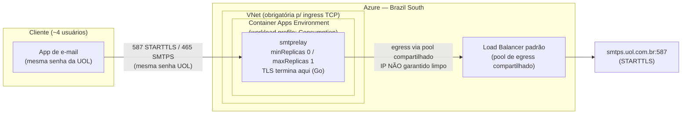
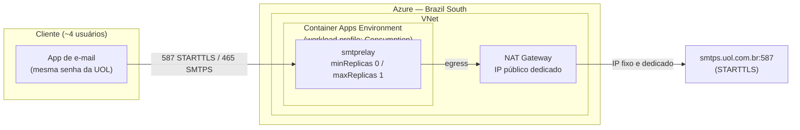

# Arquitetura

## Objetivo

Um relay SMTP para ~4 usuários que retira o IP residencial/compartilhado do
caminho de conexão final com a UOL, sem recriar o mesmo problema usando um
pool de egress igualmente "sujo" de outro tenant da Azure.

O cliente aponta o app de e-mail para `smtps.bratech.me` (portas 587/465)
em vez de `smtp(s).uol.com.br`, usando as **mesmas credenciais** da conta
UOL. O relay autentica a sessão do cliente, e então abre uma nova conexão
autenticada e criptografada até a UOL para entregar a mensagem.

## Região: Brazil South (não East US)

O plano original fixava East US. Trocado para **Brazil South** depois de
um deploy real falhar com `AKSCapacityHeavyUsage` — a Azure estava sem
capacidade de AKS pra provisionar novos ambientes Container Apps
workload-profiles em East US (2026-09). Brazil South também tem a
vantagem de latência mais baixa até a UOL e o cliente, que são
brasileiros — o East US original não tinha uma razão de negócio específica
por trás, só era o exemplo do plano. Confirmado que Brazil South suporta
workload profiles. Custos em [cost.md](cost.md) já refletem essa região.

## Por que o VNet é obrigatório nos dois modos

O plano original previa VNet apenas no Modo B (para o NAT Gateway). A
pesquisa técnica (Fase 2) encontrou uma restrição mais fundamental na
documentação oficial do Azure Container Apps:

> "External TCP ingress is only supported for Container Apps environments
> that use a virtual network."
> — [Ingress in Azure Container Apps](https://learn.microsoft.com/en-us/azure/container-apps/ingress-overview)

SMTP é TCP puro (não HTTP), então **qualquer** ambiente que aceite
conexões SMTP externas na porta 587/465 precisa ser um ambiente
"workload profiles" com VNet integrada — independente de haver ou não NAT
Gateway. Confirmamos separadamente que um workload profile do tipo
`Consumption` dentro de um ambiente VNet-integrado ainda escala a zero e é
cobrado por réplica em uso, igual a um ambiente "Consumption-only" — ou
seja, a premissa de custo ~zero do Modo A sobrevive, só que a VNet deixa de
ser opcional e passa a ser pré-requisito técnico.

Isso significa que `infra/modules/networking.bicep` agora é implantado em
**ambos os modos**; a única coisa que o parâmetro `enableDedicatedEgress`
liga/desliga é o módulo `nat-gateway.bicep`.

## Modo A — Econômico (padrão)

- Container Apps, workload profile `Consumption`, `minReplicas: 0`, `maxReplicas: 1`.
- VNet integrada (exigida para o ingress TCP), **sem** NAT Gateway.
- Egress usa o pool de SNAT compartilhado do Load Balancer padrão da Azure.
- **O IP de saída não é garantido como limpo neste modo.** O objetivo do
  Modo A é validar que autenticação, TLS e o relay em si funcionam
  corretamente — não resolver definitivamente o problema de reputação de
  IP.
- Custo alvo: ~zero fora do consumo mínimo do Container Apps (a VNet em si
  não tem custo direto).
- Para descobrir o IP de saída atual a qualquer momento, veja
  [operations.md](operations.md#descobrir-o-ip-de-saida-atual).

## Modo B — IP dedicado (opcional, custo assumido pelo cliente)

- Tudo do Modo A, mais: NAT Gateway associado à subnet de infraestrutura,
  dando um único IP de saída estável e dedicado.
- Ativado só via `enableDedicatedEgress: true` — nunca como caminho
  obrigatório.
- Custo real e contínuo (gateway hours + dados processados) — ver
  [cost.md](cost.md). Só ligar depois do cliente aceitar o custo.
- Se o ambiente for recriado, o IP público pode mudar — processo de
  captura documentado em [operations.md](operations.md#modo-b-capturar-o-ip-dedicado).

## Regra de implementação

Alternar entre os modos é só trocar `enableDedicatedEgress` em
`infra/parameters/*.parameters.json` — nenhum outro arquivo Bicep precisa
mudar. Isso também viabiliza subir e derrubar o ambiente inteiro sob
demanda (infraestrutura efêmera): `az deployment group create` recria tudo
do zero em qualquer um dos dois modos.

## Fluxo de uma mensagem

1. Cliente conecta em `smtps.bratech.me:587` (STARTTLS) ou `:465` (TLS
   implícito).
2. Relay exige `STARTTLS`/TLS antes de aceitar qualquer `AUTH`
   (`AllowInsecureAuth: false` — nunca aceita credenciais em texto claro).
3. Cliente autentica via `AUTH PLAIN` com o e-mail e senha reais da UOL.
4. Relay valida contra a única credencial fixa configurada
   (comparação em tempo constante) — qualquer outra credencial é
   rejeitada.
5. Relay exige que o `MAIL FROM` bata com a conta autenticada (impede
   forjar remetente mesmo autenticado — ver [security.md](security.md)).
6. Na `DATA`, o relay abre uma nova conexão STARTTLS autenticada para
   `smtps.uol.com.br:587` e repassa a mensagem.
7. Falha no upstream (indisponível, timeout) vira um erro temporário
   (4xx) para o cliente — a mensagem nunca é aceita e descartada
   silenciosamente.

## Por que Go + `github.com/emersion/go-smtp`

- Binário estático único → imagem final `distroless`, poucos MB.
- Cold start rápido — relevante com `minReplicas: 0`.
- Baixo consumo de CPU/RAM em repouso.
- `net/smtp` + `crypto/tls` da standard library cobrem a conexão de saída
  autenticada com STARTTLS até a UOL, sem dependências extras.
- Graceful shutdown e timeouts simples via `context`/goroutines.
